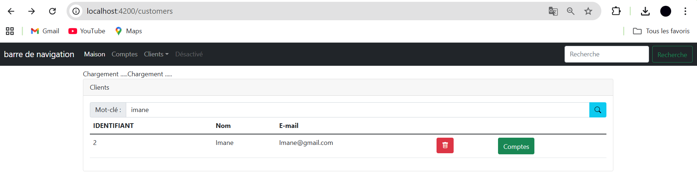
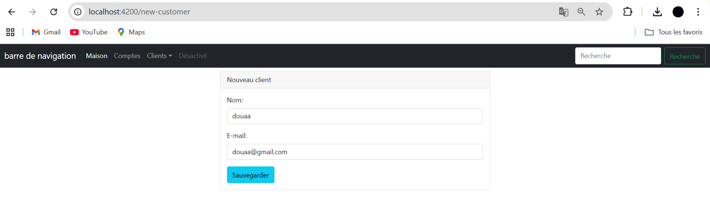
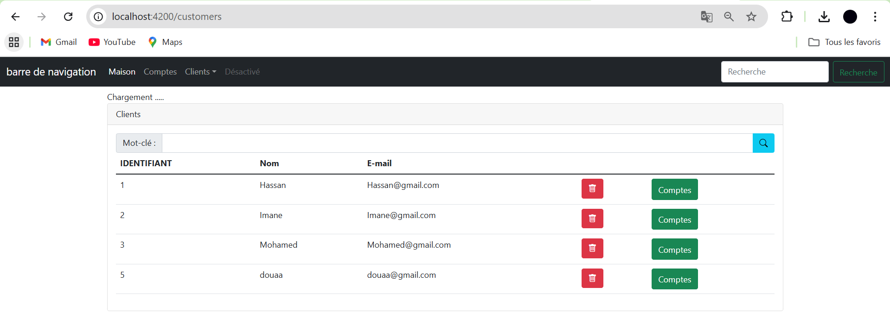
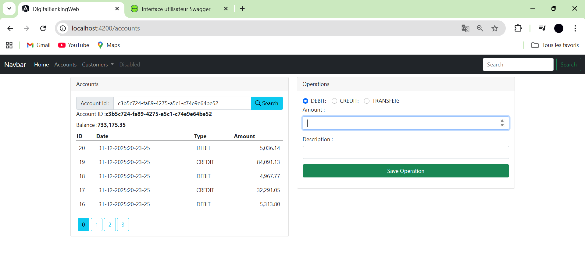

# Client Angular

### 1. Introduction

Ce projet est un client Angular permettant d’interagir avec l’API Spring Boot de gestion de comptes bancaires. L’objectif est de fournir une interface utilisateur moderne pour :

Consulter, créer et gérer des clients.

Gérer les comptes bancaires (courants et épargnes) d’un client.

Effectuer des opérations bancaires (débit, crédit) sur les comptes.

Visualiser l’historique des opérations et le solde des comptes.

### 2. Objectifs

Développer une interface web réactive pour interagir avec l’API REST.

Fournir des formulaires et tableaux pour la gestion des clients et comptes.

Intégrer la navigation Angular avec des composants modulaires.

Afficher les données reçues de l’API Spring Boot en temps réel.

### 3. Installation

Installer les dépendances :

```bash
npm install
```
Lancer l’application Angular :
```bash
ng serve
```
Ouvrir le client dans un navigateur :
http://localhost:4200

### 4. Fonctionnalités principales

Gestion des clients : création, consultation, modification.

Gestion des comptes : création de comptes courants et épargnes.

Opérations bancaires : débit et crédit sur les comptes.

Affichage dynamique : tableaux et formulaires interactifs.

Communication REST : toutes les données sont récupérées depuis l’API Spring Boot.










### 5. Conclusion

Ce client Angular fournit une interface moderne et interactive pour gérer les comptes bancaires via l’API Spring Boot. Grâce aux composants modulaires, services Angular et HttpClient, il permet de consulter et manipuler les données en temps réel. Le projet est conçu pour être extensible et facilement intégrable avec d’autres services REST.
